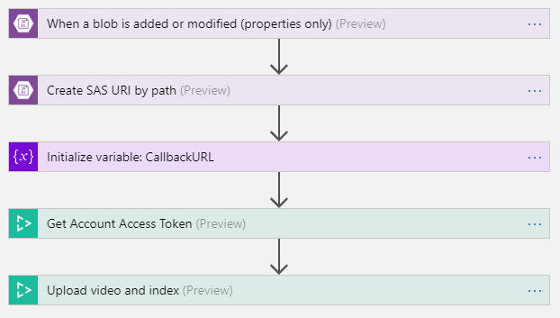

# Video Indexer + Zoom Media

_Update August 6, 2018:_ This Logic App now uses the official Video Indexer V2 Connector for Logic Apps.

## Introduction
The Microsoft [Video Indexer](https://www.videoindexer.ai/) service extracts valuable insights from videos, such as spoken words, faces, characters and emotions. The service supports many of the major world languages (but not every language, e.g. Dutch). But there are companies such as Zoom Media that offer a [speech-to-text](https://www.zoommedia.ai/speech-to-text/) service in other languages (e.g. Dutch). Below is a description of how you can use a transcription service provider (such as Zoom Media) in conjunction with Microsoft Video Indexer.

The PowerShell script included in this repo will deploy a set of Azure resources that integrate the Microsoft Video Indexer service with Zoom Media's speech-to-text service. This script can be easily updated to work with other transcription service providers to cover a broader range of languages.

## Deployment
Please ensure that you are logged into your Azure environment first in PowerShell using a command such as "Connect-AzAccount".

Next we can deploy the required resources using the deploy.ps1 script:

`.\deploy.ps1 -videoindexerregion aaaaa -videoindexeraccount bbbbbbbb-bbbb-bbbb-bbbb-bbbbbbbbbbbb -videoindexerkey xxxxxxxxxxxxxxxxxxxxxxxxxxxxxxxx -zoommediatoken yyyyyyyyyyyyyyyyyyyyyyyyyyyyyyyyyyyyyyyyyy" -language nl-nl
`

The required parameters are:
- videoindexerregion - can be found at the top of the page behind the Account name. The follow values are valid:
    - "trial"
    - "northeurope"
    - "westus2"
    - "eastasia"
- videoindexeraccount - can be found on the Settings page
- videoindexerkey - see "How to get the Video Indexer key" below
- zoommediatoken - see "How to get the Zoom Media token" below
- language - currently ZoomMedia supports:
    - Dutch: "nl-nl"
    - Norwegian: "nb-no"
    - Danish: "da-dk"
    - Swedish: "sv-se"

When running the script the following resources will be deployed:
* Resource Group
* Storage Account
* API Connection
* Three Logic Apps

## Solution flow
1. A file is added to the Blob Storage's "uploads" container
2. Logic App #1 watches this container for new files and sends new files to Video Indexer
3. Logic App #2 receives a callback from VI and sends the file to Zoom Media
4. Logic App #3 receices a callback from ZM and sends the resulting VTT to Video Indexer 
5. Video Indexer will now show the video with transcript in the target language

## How to get the Video Indexer key
The Video Indexer service does not require signup; one can simply sign in using existing credentials. Once signed in navigate to the [API Reference](https://api-portal.videoindexer.ai/). Sign in here and register for the API on the [Products](https://api-portal.videoindexer.ai/products) page. Once this is done, the [Profile](https://api-portal.videoindexer.ai/developer) page will show the primary and secondary key.

## How to get the Zoom Media token

The Zoom Media service does require signup; please contact <info@zoommedia.ai>.

Once signed up, a token can be generated on the Settings page

## Additional notes
* Note that the file will be indexed _twice_ by VideoIndexer: Once during the initial upload, and once when the VTT is updated in the end. Please wait for the Logic App to completely finish before expecting the video Transcript to be correct in the Video Indexer UI.

## Logic app flow

The template generates 3 separate Logic Apps, each taking care of one step in the total process. The relevant settings and keys are prefilledby the template into these logic apps. 

*Logic app #1: Uploads video file to Video Indexer*

*Logic app #2: Uploads video file to Zoom Media*

*Logic app #3_ Updates VTT file in Video Indexer*

## More information
For more information on how to use the Video Indexer API please see [this blog post](https://blogs.msdn.microsoft.com/golive/2018/03/26/using-microsoft-azure-video-indexer/) by Greg Oliver (@sebastus).

